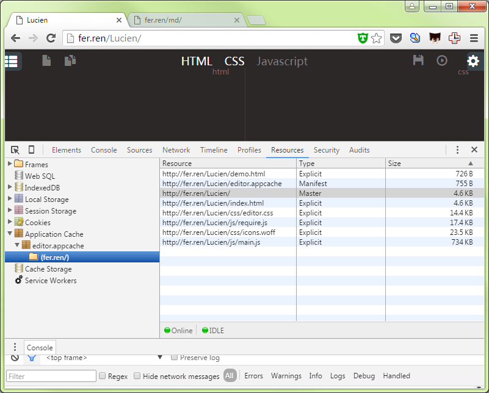
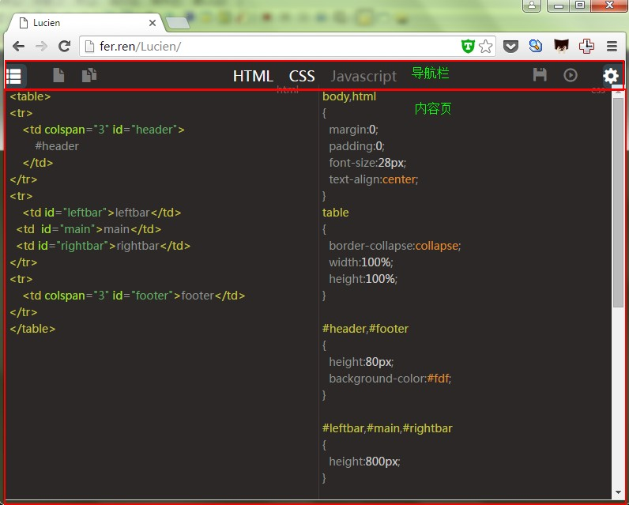

#用H5打造一个离线的Web编辑器

##目录
    - 一背景

## 一. 背景

个人看好H5的发展，个人认为h5带给我们最大的好处，是以后web app既可以有c/s模式的原生应用一样的优点：有本地数据库indexDB,离线操作在线同步，又可以免下载易嵌入易排板跨平台推广更方便。   
 一个C/S App，不考虑流量资费,从用户点击下载到App成功启动，至少要1分钟，中间可能还要人为操作点数次。而H5做的Web App,可边展示边加载，首屏加载只要2s内.  
 首屏加载完成后，可开始动态的加载其它资源：同步indexDB,缓存其它页面的css,js,img，达到每个页面都可以“秒进”的效果。
 本人之前做的是后端项目，看好H5的发展,这是一个H5练手的项目，一个基于CodeMirrir的Web可离线编辑器，与大家分享。
 
 首先说一说实现的特性和效果，再从技术的细节分析各个模块的实现和部份性能优化。
 

 
 Github:https://github.com/etoah/Lucien

## 二. 特性及效果
###效果

####运行
   
####emmet
   
####AppCache

###功能
* 支持emmet语法
* 支持完全断网离线
* 支持本地下载
* 支持indexDB保存
* 支持代码格式化
* 支持快捷键
* 代码高亮
* 运行展示

Demo地址：http://fer.ren/Lucien/


## 布局

对于一个项目首先映入眼帘的


布局用的是CSS3的弹性布局。为了实现导航栏和内容页(编辑器)布满屏幕，同时减少repaint和redraw的影响。主要的上下栏布局的方法是弹性布局。
代码如下：
```css
.nav {
    position: absolute;
    height: 30px;
    line-height: 30px;
    width: 100%;
    background: #2c2827;/*TODO:theme*/
}
.editors
{
    position: absolute;
    top: 30px;
    bottom: 0;
    display: -webkit-flex; /* Safari */
    display: flex;
    flex-wrap: nowrap;
    justify-content:flex-end;
    background: #2c2827;/*TODO:theme*/
}

```


而对于CSS编辑窗口，CSS3的弹性布局可很方便的实现，自动充满


##交互事件绑定和快捷键


##提示和动画

## 三. 存储：indexDB

###用什么存
要实现一个编辑器，首先我们面临着一个问题，代码存在哪？   
要离线可用，那么肯定不能post到服务器端，client端只有cookie,storge,WebSQL,indexDB   
cookie在部份浏览器有大小限制，而且如果后面要做服务器端的话，数据会写的http头部，不考虑。   
WebSQL是废弃的标准，不考虑。   
剩下的只有localstorge和indexDB.   
做过后端马上反应是用DB,那为什么不用localstorge呢。   
localstorge也有大小限制（5MB），而且不像indexDB有存储空间，localstorge所有的数据直接用key访问。不适合存数据。   

所以选择了indexDB 。  

###异步嵌套的问题
由于所有的indexDB的操作都是异步的，如果我们希望把取出的id加1然后返回就需要这样：

```js
indexedDB.open(dbName, dbVersion).onsuccess=function(e)｛
var db=e.target.result;
var tx = db.transaction('info', 'readwrite');
var store = tx.objectStore('info');
store.get('id').onsuccess = function (e) {
  store.put({key:'id',value:e.target.result.value + 1}).onsuccess = function (e) {
    ……
  };
};
｝

```

这里还没有onerror的操作，如果加上了更是不忍直视，所以引进了Promise异步编程模式。

我们对所有的异步操作都Promise化：

比如 打开数据库和添加数据。
```js

    function DBready(storeName) {
        return new Promise(function (resolve, reject) {
            new IDBStore({
                storePrefix: '',
                dbVersion: '1',
                storeName: storeName,
                keyPath: 'id',
                autoIncrement: true
            }, resolve);//'this' is IDBStore
        });
    }

    function add(storeName, value) {

        return DBready(storeName).then(function (factory) {

            return new Promise(function (resolve, reject) {

                factory.put(value, resolve, reject)
            })
        });
    }

```

把所有的CURD操作封装在[Entity.js](https://github.com/etoah/Lucien/blob/master/Source/FE/js/lib/Entity.js)

在code.js就可以实现多态了。完整代码请移步：[Code.js](https://github.com/etoah/Lucien/blob/master/Source/FE/js/app/Code.js)
```js

Code.prototype.add = function () {
        this.entity.synctime = new Date().format("yyyyMMddhhmmss");
        parseInt(local(config.storeKey))&&(this.entity.id=parseInt(local(config.storeKey)));
        return Entity.add(STORE_NAME,this.entity).then(function(data){
             return new Promise(function(resolve, reject){
                 local(config.storeKey,data);
                 this.entity&&(this.entity.id=data);
                 resolve(this.entity);
             });

        });
    };

```

优化后新增一条记录就是这样：
```js

    Code.save=function(editor){
       return new Code(editor.html.getValue(), editor.css.getValue(), editor.js.getValue()).add();

    };
```

###storage存储


##通迅:work实现多线程
数据我们存储在client的indexDB，如果我们要实现server与client可以相互同步，就要考虑可服务性和性能的问题了。
如果需要同步，我们就要对比client和server的数据的时间戳，以最新的为准，如果同步一两个数据，由于indexDB和request都是异步的，
页面即不会卡住，可步的时间点也可控。

但是问题来了，如果我要同步1000条数据呢。


## 四. 模块化和打包

这个WebApp,虽功能较少，但五脏俱全。模块较多，如果不进行模块化的话，可能过了一周，我可能自己都不能快速的找到代码了，   
模块化可以更好的把复杂的问题，分解成更小的问题，同时更好的功能细分，也会带来更佳的复用。     
但同时也带来的问题：模块化给我们带来了29个js文件！   
我们不可能让一个WebAPP每次都加载29个js文件。   

我们需要打包，当时试用了几个打包的工具都不好用，还是requirejs官方的r.js好用

打包的配置文件[build.js](https://github.com/etoah/Lucien/blob/master/Source/FE/js/build.js):
```js

({

	baseUrl: 'lib',
	paths: {
        app: '../app'	,
		main:'../main'
    },
   dir: '../public/js',
    modules: [
        {
            name: 'main'
        }
    ],
    optimize:"uglify2",
    fileExclusionRegExp: /^(r|build)\.js$/,
    optimizeCss: "none",
    removeCombined: true
})
```

gulp合并压缩js的任务代码：

```js
// 脚本
gulp.task('rjs', shell.task(['node js/r.js -o js/build.js']));
gulp.task('js', function () {
    return gulp.src('js/require.js')
        .pipe(uglify())
        .pipe(gulp.dest(config.jsPath))
        .pipe(notify({message: 'require task complete'}));
});
```
全部打包代码请移步：[gulpfile.js](https://github.com/etoah/Lucien/blob/master/Source/FE/gulpfile.js)

## 五. 离线：appCache

用appCache和indexDB，我们可以轻易的实现离线。但是除了离线这个好处，还有什么好处吗？

即使合并压缩了js文件和css文件，由于引用了CodeMirror库的原因,js文件还是有733kb！

我们不可能每次都让server返回这么大的文件回来。

我们用appCache，除了第一次访问，每次都从cache中加载。实现第二次秒进！

###第一次加载怎么提升速度
如果是商业化的应用，一般会有一个介绍页，我们可以在介绍页内动态的加载一个frame(window.onload后)，这加载一个空的页面，页面的html属性设计为  `manifest="editor.appcache"`
这个页面的appcache与webapp应用的cache设置为同一个文件，就可以“偷偷”提前的加载缓存，这样webapp第一次也可以“秒进”

关于appCache可以看持续更新的松土文：[HTML5 Application cache初探和企业应用启示](http://www.cnblogs.com/etoah/p/4931903.html)


## 六. 更一步

1. 云端同步。由于本人原来是做后端，这一步太熟悉了反而没有兴趣去实现。后面可能会实现这个功能。


## 总结

这次总结，比较随意，只有部份的技术要点，没有清晰的思路，此项目持续更新中。